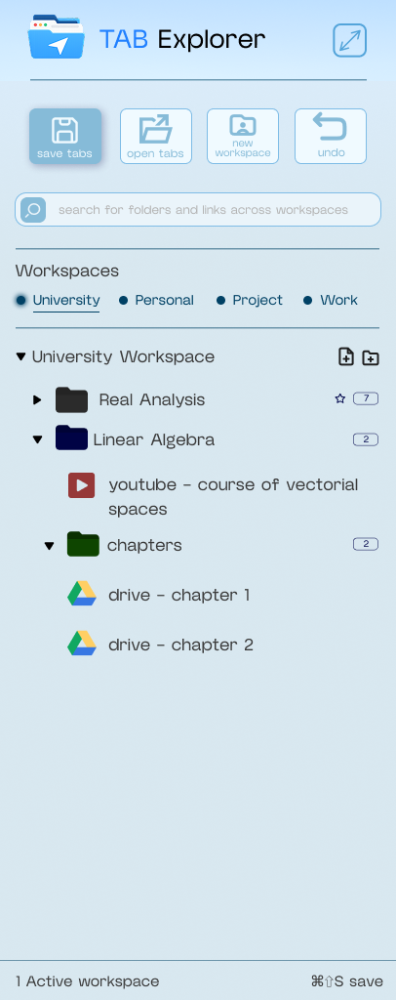

# Cahier des Charges
## TabExplorer — A File-Explorer-Style Tab & Bookmark Manager for Chrome

**Author:** Ayoub Benaziza
**Version:** 1.0 (Draft)
**Date:** July 2026

---

## 1. Context & Problem Statement

When working on a project (university coursework, personal projects, research), the author routinely accumulates dozens of open Chrome tabs across multiple contexts (e.g. university courses, ongoing projects, personal browsing). Chrome's native tab and bookmark systems do not offer a fast, structured way to organize and restore these tabs, which creates two concrete problems:

1. **Fear of data loss** — the PC cannot be shut down without risking the loss of tabs that haven't been manually saved elsewhere.
2. **Cognitive overload** — dozens of tabs across unrelated projects sit open simultaneously because there is no fast way to "put a project away" and bring it back later.

## 2. Vision

Most existing tab managers are built around the concept of **sessions** (a snapshot of what was open). TabExplorer instead treats saved tabs as **first-class objects** — files with a URL, a title, and metadata — organized inside folders, manipulated exactly like a file system (create, rename, move, copy, cut, paste, delete). The mental model shifts from *"restore my browsing session"* to *"open my project's folder."*

The target experience: familiarity. Anyone who has used Windows Explorer (or VS Code's file tree) should be able to use TabExplorer with zero learning curve.

## 3. Goals & Non-Goals

### 3.1 Goals
- Let the user organize saved links into an arbitrarily nested folder structure, itself contained within named **workspaces** (e.g. University, Personal, Project, Work) that separate unrelated contexts from one another.
- Make saving the current set of open tabs into a folder a 2-second, no-typing action.
- Make reopening a folder's tabs a single action.
- Provide a file-explorer-grade interaction model: multi-select, drag & drop, right-click context menu, keyboard shortcuts, rename-in-place.
- Be resilient — never lose saved data due to a crash or reinstall.

### 3.2 Non-Goals (explicitly out of scope for v1)
- Full tab suspension / memory management (Chrome and other dedicated extensions already solve this).
- Cross-device sync beyond what `chrome.storage.sync` provides for free.
- Cloud backend / account system.
- Multi-browser support (Firefox, Edge) — Chrome (Manifest V3) only for v1.

## 4. Target User

Primarily the author: a student/developer juggling several concurrent projects (university modules, personal software projects, research), who needs to "shelve" a full working context and restore it exactly later without manual re-collection of links.

## 5. Feature Specification

Features are grouped by priority tier, matching what is realistically achievable with Chrome Extension (Manifest V3) APIs.

### 5.1 Workspaces — Top-Level Organizational Layer

This concept was added after the initial draft, once the side-panel UI (see Fig. 1 below / §7.1) made clear that folders needed a higher-level container to keep unrelated contexts from mixing.

A **Workspace** is the top-level container in the hierarchy — above folders, not a variant of them:

```
Workspace ("University")
  └── Folder ("Linear Algebra")
        ├── Link ("youtube – course of vectorial spaces")
        └── Folder ("chapters")
              ├── Link ("drive – chapter 1")
              └── Link ("drive – chapter 2")
```

**Rules governing workspaces:**

- **Every folder and link belongs to exactly one workspace.** Creating a folder or a link-file is always an operation performed *inside* a workspace — there is no "global root" outside of one. The user must have a workspace open before they can create anything.
- **Workspaces are listed as a switcher row** at the top of the panel (e.g. *University · Personal · Project · Work*), each shown as a labeled pill with a status dot.
- **Left-click a workspace → Replace.** Clicking a workspace pill replaces the currently displayed tree with that workspace's content. Only one workspace is "active" in this mode.
- **Right-click a workspace → Append Workspace.** This opens a context menu whose "Append Workspace" action adds that workspace's tree *alongside* the one(s) already open, producing a merged, multi-workspace view — several workspace trees stacked in the same panel.
- **Moving items between open workspaces.** Once two or more workspaces are appended together, folders and links can be dragged, cut, or copied from one workspace's tree into another's, exactly as if they were two folders side by side. This is the same underlying move/copy engine as §5.2 (Tier 1, items 1.3), just operating across a workspace boundary rather than within one.
- **Workspaces reuse the folder-level Save/Open actions.** The same "Save current tabs" and "Open all tabs" operations that apply to a folder apply to an entire workspace: *Save Tabs* can target a workspace directly (saving into whichever folder is active inside it, or creating a top-level link there), and *Open Tabs* on a workspace opens everything inside it, batched per §6.1.
- **New Workspace** is a first-class toolbar action (see the "new workspace" button in the panel toolbar), distinct from "New Folder."

This restructuring makes the whole system more predictable: a folder's identity is always resolvable to "which workspace is this in," multi-context work (e.g. having University and Project open side by side to move a shared reference link) becomes a supported workflow rather than a workaround, and it maps cleanly onto the mental model of "one workspace per area of my life," which is exactly the problem described in §1.

### 5.2 Tier 1 — Core (v1 MVP)

| # | Feature | Description | Chrome API / Mechanism |
|---|---------|-------------|--------------------------|
| 1.1 | Workspace + folder / file tree | Named workspaces, each containing nested folders and "link files" (title, URL, favicon, created/updated timestamps). | `chrome.storage.local`, flat data model with `workspaceId` + parent-ID references |
| 1.2 | Create / rename / delete | For workspaces, folders, and link-files. | Local CRUD on the stored tree |
| 1.3 | Move / copy / cut / paste | Standard file-manager operations, via right-click menu, keyboard shortcuts, or drag & drop — including across two or more appended workspaces. | In-memory clipboard state + tree mutation |
| 1.4 | Save current tabs → folder / workspace | One click / one shortcut. User picks a target folder or workspace from a small picker modal, and chooses **Append** or **Replace**. | `chrome.tabs.query({currentWindow:true})` |
| 1.5 | Open all tabs in a folder / workspace | One click / one shortcut opens every link in the selected folder(s) or entire workspace. | `chrome.tabs.create` (batched — see §6.1) |
| 1.6 | Multi-select folders/files | Ctrl-click and Shift-click, exactly like Explorer, for bulk open/move/delete. | Client-side UI selection state |
| 1.7 | Workspace switcher: replace vs. append | Left-click a workspace pill to replace the view; right-click → "Append Workspace" to view/edit multiple workspaces at once. | Client-side UI state; independent of storage layer |
| 1.8 | Right-click context menu | Custom, in-extension menu (not the OS/browser one) offering Open, Rename, Cut, Copy, Paste, Delete, New Folder, Append Workspace, Properties. | Custom HTML/CSS component |
| 1.9 | In-panel keyboard shortcuts | Ctrl+C / Ctrl+V / Ctrl+X / Delete / F2 / Ctrl+A / arrow-key navigation — active while the panel has focus. | JS `keydown` listeners inside the extension UI |
| 1.10 | Global keyboard shortcuts (limited set) | 2–4 OS-level shortcuts (e.g. Save Tabs, Open Panel) that work even when the extension isn't focused. | `chrome.commands` (Chrome limits the number of default-bound global shortcuts; extra ones are user-bindable in `chrome://extensions/shortcuts`) |
| 1.11 | Creation modal | Popup dialog asking for Name (+ URL, for manually-added links) when creating a folder or a link-file by hand. | In-panel modal component |
| 1.12 | Duplicate detection on save | Warns if a URL already exists in the target folder; offers Skip / Replace / Keep Both. | URL string comparison during save |

### 5.3 Tier 2 — Near-term additions (v1.x)

| # | Feature | Description |
|---|---------|-------------|
| 2.1 | Drag & drop | Move/copy files and folders by dragging; Ctrl+drag to copy instead of move. |
| 2.2 | Search | Instant filter across all folders/files across all workspaces (or scoped to open ones), by title or URL. |
| 2.3 | Notes per folder/link | Free-text note field shown in the details/side panel. |
| 2.4 | Folder colors / pinned folders | Visual tagging and "always on top" pinning for frequently used folders. |
| 2.5 | Focus instead of duplicate | If a URL from the folder being opened is already open in a tab, focus that tab instead of creating a new one. |
| 2.6 | Export / Import | Export to JSON and to `bookmarks.html` (Chrome's native bookmark format); import from the same — scoped per workspace or for the whole dataset. |
| 2.7 | Auto-save snapshot | Periodic background snapshot of current tabs into a reserved "Auto-save" workspace, to recover from a crash. Uses `chrome.alarms`. |

### 5.4 Tier 3 — Later / stretch goals (v2+)

| # | Feature | Description | Notes |
|---|---------|-------------|-------|
| 3.1 | Full window-state restore | Restore not just URLs but window layout, pinned state, and tab groups, per workspace. | Achievable via `chrome.windows`, `chrome.tabGroups`, `chrome.tabs.create({pinned:true})` — real work, not fantasy, but deferred past v1. |
| 3.2 | Undo / redo | Ctrl+Z / Ctrl+Y across tree operations, including workspace-level moves. | v1 ships with single-level "undo last delete" only (see the "undo" toolbar button); a full undo stack is deferred. |
| 3.3 | "Restore previous session?" prompt on launch | Offers to restore an auto-saved snapshot after a crash/update. | Depends on 2.7. |

### 5.5 Explicitly cut from scope
- **Tab suspension / discarding** — redundant with Chrome's native tab discarding and dedicated suspension extensions; not this extension's job.
- **OS-level Ctrl+C/Ctrl+V hijacking outside the extension's own UI** — not something the Chrome extension platform allows, and not necessary since in-panel shortcuts cover the actual use case.

## 6. Key Technical Risks & Design Decisions

### 6.1 Opening large folders (the hardest problem)
Opening a folder with 100+ links at once will momentarily freeze Chrome and is poor UX regardless of implementation. **Design decision:** if a folder exceeds a threshold (e.g. 20 links), the user is warned and offered to open in batches (e.g. 20 tabs at a time, with a short delay between batches).

### 6.2 Data model
Store workspaces, folders and links as a **flat list with `workspaceId` + parent-ID references**, not nested JSON. This keeps move/copy/cut/paste/delete operations O(1) lookups instead of requiring a tree walk, which matters once the structure gets deep or wide — and it makes "which workspace is this item in" a direct field lookup rather than a walk up to the root, which matters now that operations (move, save, open) can cross workspace boundaries.

```
Workspace {
  id, name, color, icon,
  createdAt, updatedAt, notes
}

Folder {
  id, workspaceId, parentId, name, color, pinned,
  createdAt, updatedAt, notes
}

Link {
  id, workspaceId, parentId, title, url, favicon,
  createdAt, updatedAt, lastOpened, timesOpened, notes, tags
}
```

`parentId` is `null` for folders/links sitting directly at a workspace's root; otherwise it points to the containing folder. `workspaceId` is always set, on every folder and link, regardless of nesting depth — this is what makes cross-workspace search, move, and "open entire workspace" operations fast.

### 6.3 Storage & durability
`chrome.storage.local` for the main dataset (large capacity, not synced by default — avoids sync-quota issues); optionally mirror a lightweight structure into `chrome.storage.sync` later for cross-device folder names only, if needed. Regular export to JSON is the primary "insurance policy" against data loss until this is proven reliable in daily use.

### 6.4 Right-click menu
Chrome's native `chrome.contextMenus` API only attaches to browser surfaces (web pages, the browser tab strip, etc.) — it cannot be used to build a custom menu *inside* the extension's own UI. The Explorer-style right-click menu must therefore be a **custom-built HTML/CSS component** inside the extension's panel.

## 7. User Interface

The UI is the single most important design decision in this project, since the "feels like a native file explorer" premise is the whole value proposition. A VS Code Explorer-style single sidebar tree is a good default for everyday speed, but it becomes cramped for anything needing more screen space (notes, favicons at a glance, side-by-side folder comparison, import/export screens). The proposed solution is **two coordinated surfaces sharing the same underlying data**, mirroring how VS Code itself has both a sidebar and full editor tabs.

**Fig. 1 — Current side panel UI draft** (author's mockup, incorporating the workspace switcher described in §5.1):



### 7.1 Surface A — Side Panel (everyday use)

Implemented with the `chrome.sidePanel` API — **not** the classic popup, which closes the instant it loses focus and is therefore incompatible with drag-and-drop, multi-select, and any workflow that requires clicking back and forth between the panel and the page.

The reference behavior is extensions like **Sider** (the multi-AI chat side panel): the panel stays docked and open across tab switches and page navigation, and it is the **user** who decides when to close it — not the browser. This persistence is what makes VS-Code-like interactions possible: dragging a link into a folder, multi-selecting with Ctrl/Shift across several clicks, or dropping a tab into place all require the panel to still be there after the pointer briefly leaves it.

**Purpose:** fast, keyboard-driven, always-available. This is where 90% of interactions happen.

Contents (see Fig. 1, the current UI draft):
- **Toolbar** at the top: Save Tabs, Open Tabs, New Workspace, Undo — each also bound to a keyboard shortcut (e.g. ⌘⇧S for Save, shown in the panel's footer status bar).
- **Search bar** — filters folders and links across workspaces.
- **Workspace switcher row** — one pill per workspace (e.g. *University · Personal · Project · Work*), each with a status dot. Left-click replaces the active view with that workspace; right-click opens a context menu offering **Append Workspace**, which adds it to the current view alongside whatever is already open (§5.1).
- A collapsible folder tree per open workspace, visually similar to VS Code's Explorer (chevron-expand rows, indentation, small file/folder icons, favicons for links, item-count badges, a star for pinned items).
- Right-click context menu on any row (folder, link, or workspace pill).
- Ctrl/Shift multi-select, including across two or more appended workspaces.
- Inline rename (F2 or double-click, like Explorer).
- Drag & drop within a workspace tree, and between trees once multiple workspaces are appended.
- A status bar at the bottom (active workspace count, shortcut reminder).

### 7.2 Surface B — Full-Page "Command Center" View (deep organization)

Implemented as a `chrome.tabs.create` opening a full extension HTML page (accessible via a "Open in full view" button in the side panel).

**Purpose:** everything that needs more room than a ~300–400px sidebar can offer.

Contents:
- A two-pane layout: workspace/folder tree on the left (same component as the side panel, for consistency, including the workspace switcher), a **grid/card view** of the selected folder's or workspace's contents on the right — showing favicons, titles, URLs, and notes at a glance (this is the part a narrow sidebar cannot do well).
- Bulk drag-and-drop across multiple visible folders and workspaces at once.
- Import/Export screen (JSON, bookmarks.html), scoped to a single workspace or the whole dataset.
- Notes editor for workspaces, folders, and links.
- Settings (batching threshold, auto-save interval, shortcut rebinding shortcut).
- Snapshot/auto-save history (Tier 2/3).

### 7.3 Modals

Used for any action requiring typed input, kept intentionally lightweight and consistent across both surfaces:
- **New Workspace** — Name field (+ optional color/icon picker).
- **New Link** — Name + URL fields.
- **New Folder** — Name field.
- **Rename** — pre-filled name field (though inline F2-rename is preferred where possible; the modal is a fallback, e.g. for touch/no-keyboard-focus contexts).
- **Save Tabs to Folder / Workspace** — folder or workspace picker (searchable tree or breadcrumb selector) + Append/Replace toggle.
- **Duplicate Detected** — Skip / Replace / Keep Both.
- **Batch-Open Warning** — shown when opening a folder or workspace above the batching threshold (§6.1).

### 7.4 Visual language
Deliberately modeled on Windows/VS Code Explorer conventions (indentation guides, chevrons, familiar icon set, standard selection highlighting) rather than inventing a new visual language — the entire pitch of the product is "you already know how to use this."

## 8. Data Flow Summary

```
User Action (side panel or full page)
        │
        ▼
UI Layer (React/vanilla JS + modal components)
        │
        ▼
Data Layer (CRUD on flat workspace/folder/link store)
        │
        ▼
chrome.storage.local  ◄────────────► chrome.tabs / chrome.windows / chrome.tabGroups
   (persisted tree)         (reading current tabs / opening saved links)
```

## 9. Milestones (suggested)

| Milestone | Scope |
|-----------|-------|
| M1 — Data layer | Storage schema (workspace/folder/link), CRUD functions, flat-model tree operations, unit-testable independent of UI. |
| M2 — Side panel MVP | Workspace switcher (replace/append), tree rendering, create/rename/delete, save-tabs, open-folder, batching logic. |
| M3 — Explorer interactions | Multi-select, drag & drop (within and across appended workspaces), right-click menu, in-panel shortcuts, clipboard (cut/copy/paste). |
| M4 — Full-page command center view | Grid view, notes, import/export. |
| M5 — Polish & durability | Auto-save snapshots, duplicate detection, pinned/colored folders, global shortcut, settings page. |

## 10. Permissions Required (Manifest V3, indicative)

- `tabs` — read current tabs, open new ones.
- `storage` — persist the workspace/folder/link tree.
- `sidePanel` — render Surface A.
- `contextMenus` — optional, only if a *browser-level* "Save this tab to TabExplorer" entry is desired in addition to the in-app menu.
- `tabGroups` — deferred to Tier 3 (§5.4).
- `alarms` — for auto-save snapshots (Tier 2).

## 11. Open Questions

- Should saved data sync across devices via `chrome.storage.sync` (capacity-limited) or remain purely local with manual export/import as the sync mechanism for v1?
- Should the batching threshold and auto-save interval be user-configurable from v1, or hardcoded initially and exposed later?
- Is a full undo/redo stack (Tier 3) worth prioritizing earlier given how error-prone bulk folder deletion could be?
- Is there a practical cap on how many workspaces can be appended/displayed simultaneously before the merged tree view becomes cluttered, and should the UI enforce one?
- When "Save Tabs" targets a workspace directly rather than a specific folder, should the tabs land in a dedicated default folder inside that workspace, or sit at the workspace root?
